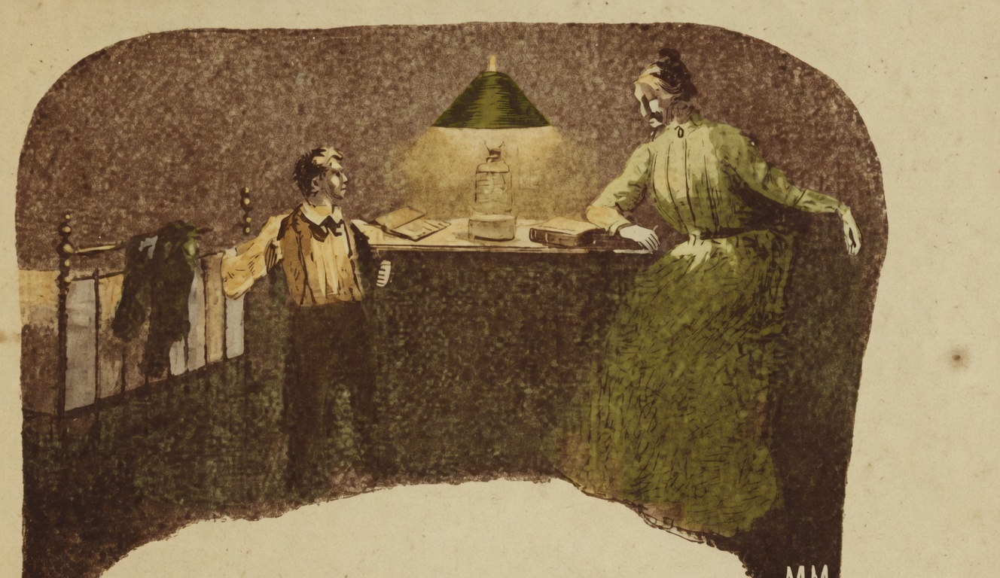

# Meia noite

{alt="Gravura de cabeçalho do poema Meia noite. Litografia da edição de 1904."}

O filho :

| Ó Mamãe! quando adormecem
| Todos, num somno profundo,
| Ha mesmo almas do outro mundo,
| Que aos meninos apparecem?

A mãe :

| Não creias n'isso! É tolice!
| Fantasmas são invenções
| Para dar medo aos poltrões :
| Não houve ninguém que os visse!

| Não ha gigantes nem fadas,
| Nem genios perseguidores,
| Nem monstros aterradores,
| Nem princezas encantadas!

| As almas dos que morreram
| Não voltam á terra mais!
| Pois vão descansar em paz
| Do que na terra soffreram.

| Dorme com tranquillidade!
| — Nada receia, meu filho,
| Quem não se affasta do trilho
| Da Justiça e da Bondade.
