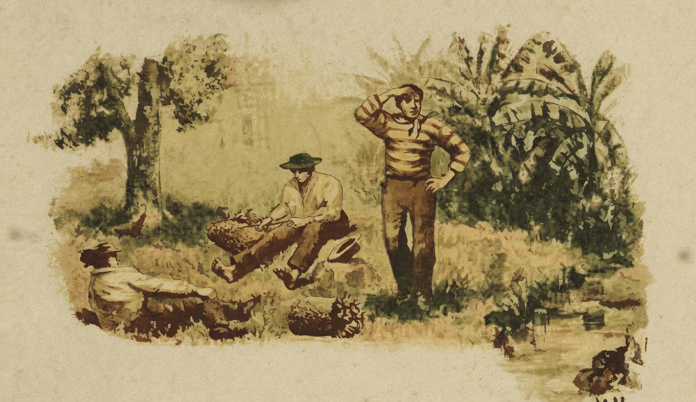

# Meio-dia

{alt="Gravura de cabeçalho do poema Meio-dia. Litografia da edição de 1904."}

| Meio-dia. Sol a pino.
| Corre de manso o regato.
| Na egreja repica o sino;
| Cheiram as hervas do matto.

| Na arvore canta a cigarra;
| Ha recreio nas escolas :
| Tira-se, n'uma algazarra,
| A merenda das saccolas.

| O lavrador pousa a enxada
| No chão, descansa um momento,
| E enxuga a fronte suada,
| Contemplando o firmamento.

| Nas casas ferve a panella
| Sobre o fogão, nas cosinhas;
| A mulher chega á janella,
| Atira milho ás gallinhas.

| Meio-dia! O sol escalda,
| E brilha, em toda a pureza,
| Nos campos côr de esmeralda,
| E no ceo côr de turqueza...

| E a voz do sino, echoando
| Longe, de atalho em atalho,
| Vae pelos campos, cantando
| A Vida, a Luz, o Trabalho!
