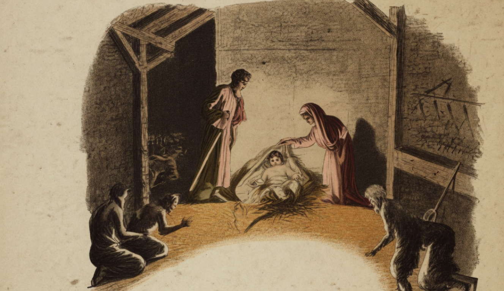

# Natal

{alt="Presépio: Maria, José e o Menino na estrebaria; figuras ajoelhadas. Litografia da edição de 1904. Iniciais HM à esquerda."}

| Jesus nasceu ! Na abobada infinita
| Soam canticos vivos de alegria;
| E toda a vida universal palpita
| Dentro d'aquella pobre estrebaria...

| Não houve sedas, nem setins, nem rendas
| No berço humilde em que nasceu Jesus...
| Mas os pobres trouxeram offerendas
| Para quem tinha de morrer na Cruz.

| Sobre a palha, risonho, e illuminado
| Pelo luar dos olhos de Maria,
| Vede o Menino-Deus, que está cercado
| Dos animaes da pobre estrebaria.

| Não nasceu entre pompas reluzentes ;
| Na humildade e na paz d'este logar,
| Assim que abriu os olhos innocentes,
| Foi para os pobres seu primeiro olhar.

| No emtanto, os reis da terra, peccadores,
| Seguindo a estrella que ao presepe os guia,
| Veem cobrir de perfumes e de flores
| O chão d'aquella pobre estrebaria.

| Sobem hymnos de amor ao céo profundo ;
| Homens, Jesus nasceu ! Natal! Natal!
| Sobre esta palha está quem salva o mundo,
| Quem ama os fracos, quem perdoa o Mal!

| Natal! Natal! Em toda a Natureza
| Ha sorrisos e cantos, n'este dia...
| Salve, Deus da Humildade e da Pobreza,
| Nascido n'uma pobre estrebaria!
