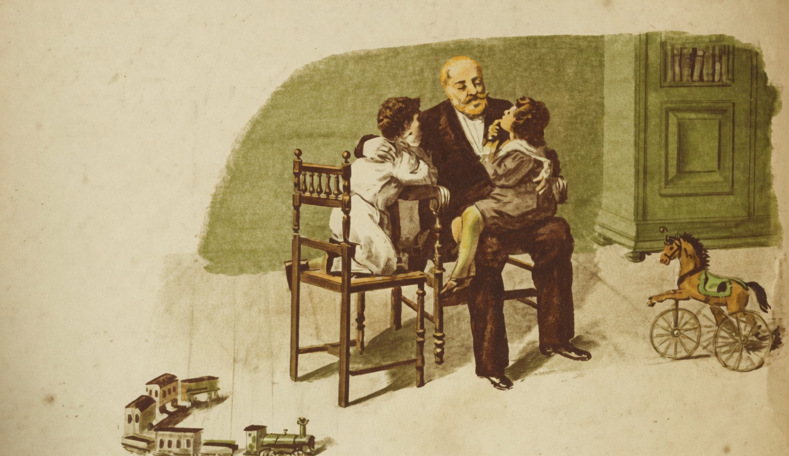

# O Avô

{alt="Gravura de cabeçalho do poema O Avô. Litografia da edição de 1904."}

| Este, que, desde a sua mocidade,
| Penou, suou, soffreu, cavando a terra,
| Foi robusto e valente, e, em outra edade,
| Servindo a Patria, conheceu a guerra.

| Combateu, viu a morte, e foi ferido;
| E, abandonando a carabina e a espada,
| Veio, depois do seu dever cumprido,
| Tratar das terras, e empunhar a enxada.

| Hoje, a custo somente move os passos...
| Tem os cabellos brancos; não tem dentes...
| Porém remoça, quando tem nos braços
| Os dois netos queridos e innocentes.

| Conta-lhes os seus annos de alegria,
| Os dias de perigos e de glorias,
| As bandeiras voando, a artilheria
| Retumbando, e as batalhas, e as victorias...

| E fica alegre quando vê que os netos,
| Ouvindo-o, e vendo-o, e lhe invejando a sorte,
| Batem palmas, extaticos, e inquietos,
| Amando a Patria sem temer a morte!
