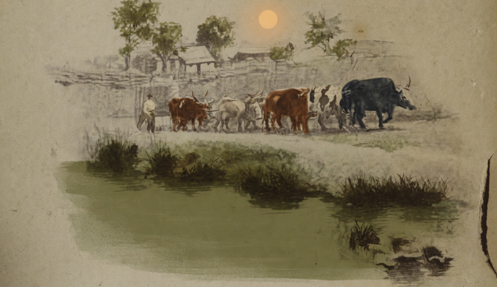

# O Boi

{alt="Bois e lavrador no campo, água em primeiro plano. Litografia da edição de 1904. Iniciais HM à direita."}

| Quando ainda no céo não se percebe a aurora,
| E ainda está molhando as arvores o orvalho,
| Sáe pelo campo a fóra
| O boi, para o trabalho.

| Com que calma obedece!
| Caminha sem parar :
| E o sol, quando apparece,
| Já o encontra, robusto e manso, a trabalhar.

| Forte e meigo animal! Que bondade serena
| Tem na doce expressão da face resignada!
| Nem se revolta, quando o lavrador, sem pena,
| Para o instigar, lhe crava a ponta da aguilhada.

| Cae-lhe de rijo o sol sobre o largo cachaço;
| Zumbem moscas sobre elle, e picam-no sem dó:
| Porém, indifferente ás dores e ao cansaço,
| Caminha o grande boi, n'uma nuvem de pó.

| Lá vae pausadamente o grande boi marchando...
| E, por elle puxado,
| Larga e profundamente o solo retalhando,
| Vae o possante arado.

| Desce a noite. O luar fulgura sobre os campos.
| Cessa a vida rural.
| Ha estrellas no céo. Na terra ha pyrilampos.
| E o boi, para dormir, regressa ao seu curral...
