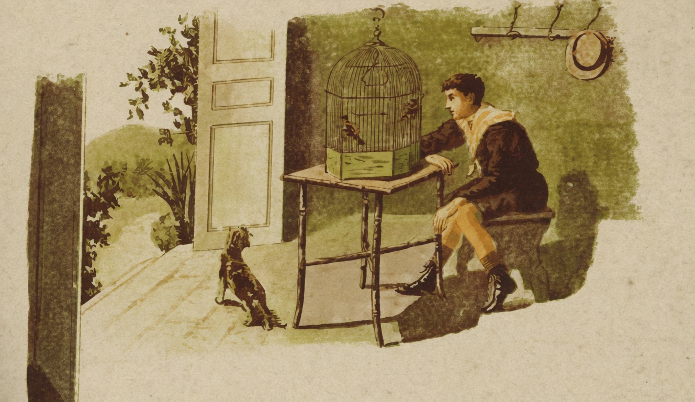

# O Passaro captivo

{alt="Menino sentado à mesa observa um pássaro na gaiola; cão ao lado; janela e plantas à esquerda. Litografia da edição de 1904."}

| Armas, num galho de arvore, o alçapão ;
| E, em breve, uma avesinha descuidada,
| Batendo as azas cáe na escravidão.

| Dás-lhe então, por esplendida morada,
| A gaiola dourada ;
| Dás-lhe alpiste, e agoa fresca, e ovos, e tudo:
| Porque é que, tendo tudo, ha de ficar
| O passarinho mudo,
| Arrepiado e triste, sem cantar ?

| É que, creança, os passaros não fallam.
| Só gorgeando a sua dor exhalam,
| Sem que os homens os possam entender;
| Se os passaros fallassem,
| Talvez os teus ouvidos escutassem
| Este captivo passaro dizer :

| « Não quero o teu alpiste !
| Gosto mais do alimento que procuro
| Na matta livre em que a voar me viste;
| Tenho agoa fresca num recanto escuro
| Da selva em que nasci ;
| Da matta entre os verdores,
| Tenho fructos e flores,
| Sem precisar de ti !
| Não quero a tua esplendida gaiola !
| Pois nenhuma riqueza me consola
| De haver perdido aquillo que perdi...
| Prefiro o ninho humilde, construido
| De folhas seccas, placido, e escondido
| Entre os galhos das arvores amigas...

| Solta-me ao vento e ao sol !
| Com que direito á escravidão me obrigas ?
| Quero saudar as pompas do arrebol!
| Quero, ao cair da tarde,
| Entoar minhas tristissimas cantigas !
| Porque me prendes ? Solta-me, covarde !
| Deus me deu por gaiola a immensidade :
| Não me roubes a minha liberdade...
| Quero voar ! voar !... »

| Estas cousas o passaro diria,
| Se pudesse fallar.
| E a tua alma, creança, tremeria,
| Vendo tanta afflicção :
| E a tua mão, tremendo, lhe abriria
| A porta da prisão...
