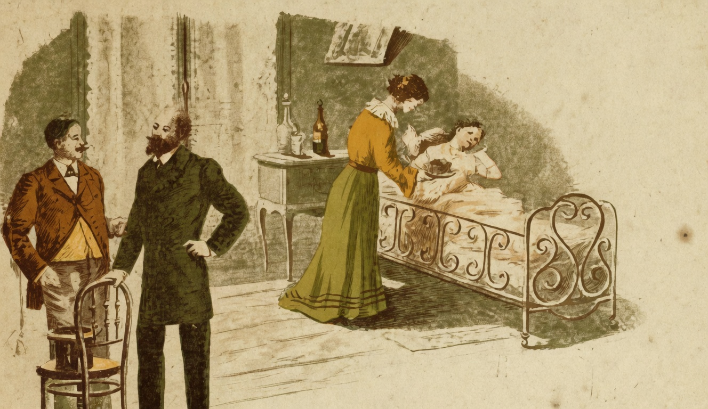

# O Remedio

{alt="Gravura de cabeçalho do poema O Remedio. Litografia da edição de 1904."}

| A Amelinha está doente,
| Chora, tem febre, delira ;
| Em casa, está toda gente
| Afflicta, e geme, e suspira.

| Chega o medico e a examina.
| Tocando a fronte abrazada,
| E o pulso da pequenina,
| Diz alegre: « Não é nada!

| « Vou lhe dar uma receita.
| « Amanhã, o mais tardar,
| « Já de saúde perfeita,
| « Ha de sorrir e brincar. »

| Vem o remedio. Amelinha
| Grita, faz manha, esperneia :
| « Não quero! »
| O pae se avisinha,
| Mostrando-lhe a colher cheia :

| « Toma o remedio, querida!
| « Dar-te-hei como recompensa,
| « Uma boneca vestida
| « De seda e rendas, immensa... »
| — « Não quero! »

| Chega a titia :
| « Amelia é boa, não é ?
| « Se fosse boa, teria
| « Toda uma arca de Noé... »

| — « Não quero! »
| Promettem tudo :
| Livros de figuras cheios,
| Um vestido de velludo,
| Brinquedos, jóias, passeios...

| Teima Amelinha. Faz manha.
| E diz o pae, já com tedio :
| — « Menina! você apanha,
| Se não toma este remedio ! »

| E nada! a menina grita,
| Sem querer obedecer.
| Mas nisto, a mamãe afflicta,
| Põe-se a gemer e a chorar.

| Logo Amelinha, callada,
| Mansa, a colher segurando,
| Sem já se queixar de nada,
| Vae o remedio tomando.

| — « Então ? mau gosto sentiste ? »
| Diz o pae... E ella, apressada :
| — « Para não ver mamãe triste,
| « Não sinto mau gosto em nada! »
