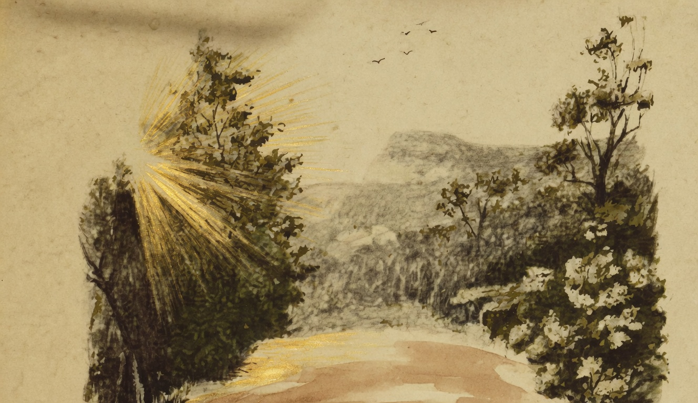

# O Sol

{alt="Clareira entre árvores, sol raiando à esquerda, pássaros no céu. Litografia da edição de 1904."}

| Salve, sol glorioso ! Ao teu clarão fecundo,
| A natureza canta e se extasia o mundo.
| Que tristeza, que dó, quando desappareces !
| Tu, a terra estragada e feia reverdeces;
| Abres com o teu calor as sebes perfumadas;
| Dás flores ao verdor das moitas orvalhadas;
| Os ninhos aquecendo, ás gargantas das aves
| Dás gorgeios de amor, e harmonias suaves ;
| E, scintillando sobre os tufos de verdura,
| Em cada ramo pões uma fructa madura.

| A noite é como a morte ; o dia é como a vida.
| Ó Sol, quando te vaes, a alma vaga perdida...
| Os pensamentos maus são os filhos da treva:
| Fogem, quando a brilhar, no horisonte se eleva
| O Sol, pae do trabalho, o Sol, pae da alegria...
| Salve, nuncio da Vida, e portador do Dia!
