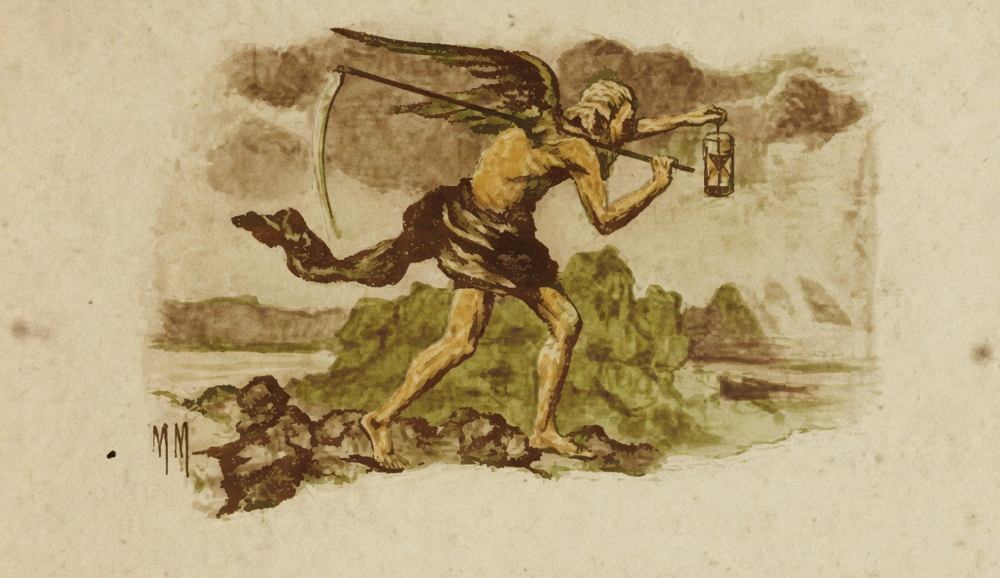

# O Tempo

{alt="Gravura de cabeçalho do poema O Tempo. Litografia da edição de 1904."}

| Sou o Tempo que passa, que passa,
| Sem principio, sem fim, sem medida!
| Vou levando a Ventura e a Desgraça,
| Vou levando as vaidades da Vida !

| A correr, de segundo em segundo,
| Vou formando os minutos que correm...
| Formo as horas que passam no mundo,
| Formo os annos que nascem e morrem.

| Ninguém pode evitar os meus damnos.
| Vou correndo sereno e constante :
| D'esse modo, de cem em cem annos,
| Formo um seculo, e passo adiante.

| Trabalhae, porque a vida é pequena,
| E não ha para o Tempo demoras !
| Não gasteis os minutos sem pena !
| Não façaes pouco caso das horas !
