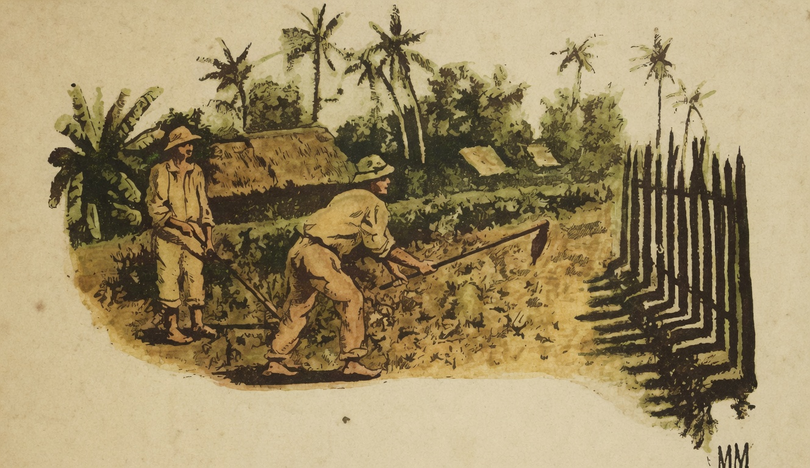

# O Trabalho

{alt="Gravura de cabeçalho do poema O Trabalho. Litografia da edição de 1904."}

| Tal como a chuva cahida
| Fecunda a terra, no estio,
| Para fecundar a vida
| O trabalho se inventou.

| Feliz quem pode, orgulhoso,
| Dizer : « Nunca fui vadio :
| E, se hoje sou venturoso,
| Devo ao trabalho o que sou! »

| É preciso, desde a infancia,
| Ir preparando o futuro ;
| Para chegar á abundancia,
| É preciso trabalhar.

| Não nasce a planta perfeita,
| Não nasce o fructo maduro ;
| E, para ter a colheita,
| E' preciso semeiar...
