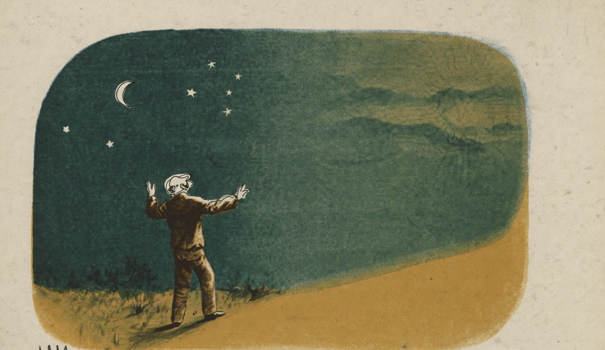

# O Universo

{alt="Homem de braços abertos sob o céu estrelado e a lua. Litografia da edição de 1904. Iniciais HM à esquerda."}

(PARAPHRASE)

A Lua :

| Sou um pequeno mundo;
| Movo-me, rolo, e danso
| Por este céo profundo ;
| Por sorte Deus me deu
| Mover-me sem descanso,
| Em torno de outro mundo,
| Que inda é maior do que eu.

A Terra :

| Eu sou esse outro mundo;
| A lua me acompanha,
| Por este céo profundo...
| Mas é destino meu
| Rolar, assim tamanha,
| Em torno de outro mundo,
| Que inda é maior do que eu.

O Sol :

| Eu sou esse outro mundo,
| Eu sou o sol ardente!
| Dou luz ao céo profundo...
| Porém sou um pygmêo,
| Que rolo eternamente
| Em torno de outro mundo,
| Que inda é maior do que eu.

O Homem :

| Porque, no céo profundo,
| Não ha-de parar mais
| O vosso movimento?
| Astros! qual é o mundo,
| Em torno ao qual rodaes
| Por esse firmamento?

Todos os Astros :

| Não chega o teu estudo
| Ao centro d'isso tudo,
| Que escapa aos olhos teus :
| O centro d'isso tudo,
| Homem vaidoso, é Deus!
