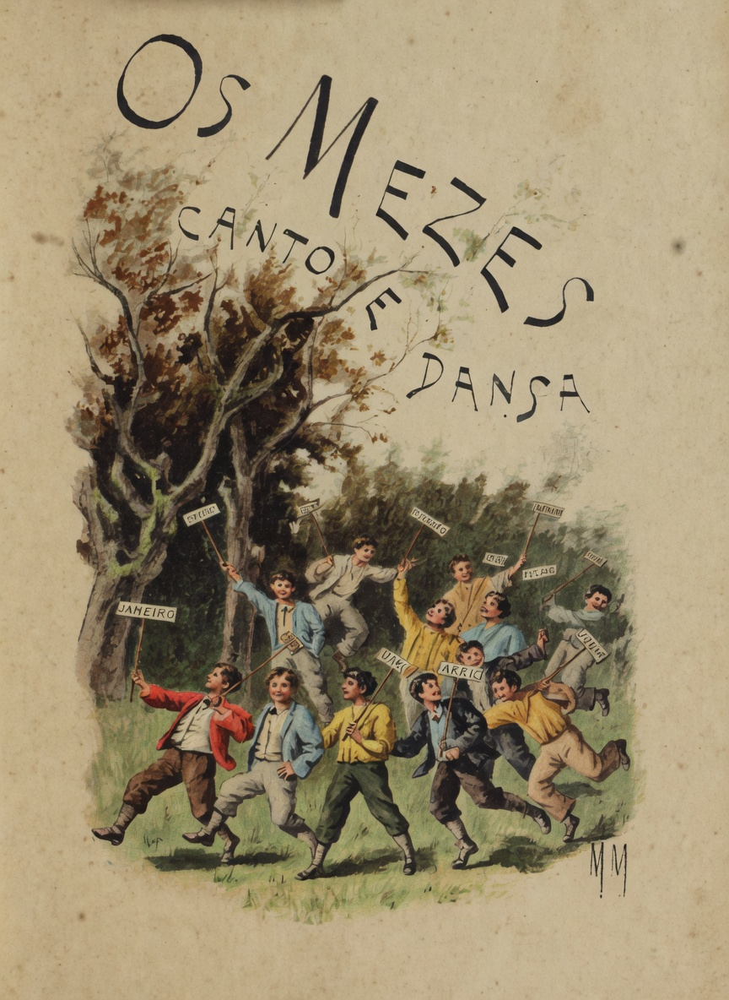

# Os mezes

{alt="Crianças dançam com bandeirolas dos meses; título «Os Mezes — Canto e Dansa». Litografia de página inteira da edição de 1904. Iniciais HM embaixo à direita."}

Côro das creanças :

| Venham os mezes desfilando!
| Cante cada um por sua vez !
| Dansemos todos, escutando
| O que nos conta cada mez...

## Janeiro

Janeiro :

| Eu sou o mez primeiro,
| O calido Janeiro !
| Ouvi minha canção !
| Dou festas e presentes...
| E os corações contentes,
| Quando appareço, estão.

| Quando appareço, os sinos
| Começam crystallinos,
| A erguer o alegre som.
| Trago para as creanças
| Affagos, esperanças,
| E festas de Anno-Bom.

| Mas, se a alegria espalho,
| Desejo que o trabalho
| Vos possa reunir :
| Mezes, eu vos saúdo !
| Eu sou o mez do estudo :
| As aulas vão se abrir!

Côro das creanças :

| Saia da roda o mez primeiro !
| Prosiga a dansa jovial!
| E entre na roda Fevereiro,
| Que é o bello mez do Carnaval!

## Fevereiro

Fevereiro :

| Fevereiro, muitas vezes,
| No meio dos doze mezes,
| É o mez mais jovial.
| É o mez da mascarada,
| Da alegria desvairada,
| Das festas do Carnaval!

| Saem a rua os diabos,
| De longos, vermelhos rabos,
| E caras de horrorisar,
| E o velho, que, dando o braço
| Ao dominó, e ao palhaço,
| Diz graçolas, a pular.

| Brincae ! por estes trez dias
| De festas e de alegrias,
| Os vossos livros deixae!
| Para alegrar vossas almas,
| Batei aos mascaras palmas,
| — Depois... aos livros voltae !

Côro das creanças :

| Saia da roda Fevereiro,
| Pois já passou a sua vez !
| Entre na roda o mez terceiro !
| Venha outro mez! Venha outro mez!

## Março

Março :

| Março, que se adianta,
| Traz a Semana Santa,
| Em que Jesus morreu :
| Foi pela Humanidade
| Que elle, todo bondade,
| Viveu e padeceu.

| Ha luto na cidade...
| Quem se humilhar não ha-de,
| Pensando na Paixão?
| Na egreja os órgãos cantam,
| E as almas se levantam,
| Cheias de gratidão.

| Orae também, creanças!
| E, suspendendo as danças,
| Lembrae-vos de Jesus,
| Que, martyr voluntario,
| Morreu sobre o Calvario,
| Nos braços de uma cruz.

Côro das creanças :

| Março morreu! Prosiga a dansa!
| Prosiga a ronda juvenil !
| E vamos ver que mez avança:
| É o mez de Abril! É o mez de Abril!

## Abril

Abril :

| Eu sou Abril! O seio
| Tenho cheiroso, e cheio
| De fructos, e de flores.
| Abril o outono encerra :
| Já pesam sobre a terra
| Os ultimos calores.

| Foi n'este mez que, um dia,
| O odio da tyrannia
| Um martyr consagrou.
| Saudae o Tiradentes,
| E os sonhos resplendentes
| Que o seu Ideal sonhou !

| Quiz ver a Patria amada
| Do jugo libertada,
| Digna do seu amor...
| — Vós, decorae-lhe a historia,
| Honrando-lhe a memoria!
| Saudae o Sonhador!

Côro das creanças :

| Um novo passo agora ensaia :
| Dansemos todos outra vez !
| Entre na roda o mez de Maio,
| Saia da roda o quarto mez.

## Maio

Maio :

| Dae-me vivas! Dae-me palmas!
| Exultem todas as almas,
| Cheias de um vivo fulgor!
| Todo o Brasil, congregado,
| Saude o mez consagrado
| Da Liberdade e do Amor!

| A grande raça opprimida
| Abri as portas da vida,
| As portas da Redempção !
| Mudei em risos as dores,
| Mudei em tufos de flores
| Os ferros da escravidão!

| Treze de Maio! A desgraça
| Findou de toda uma raça!
| — Aos beijos, dando-se as mãos
| Os brasileiros se uniram,
| E o captiveiro aboliram,
| Ficando todos irmãos.

Côro das creanças :

| Maio já deu o seu recado...
| Prosiga, em dansas, a funcção!
| Entre na roda o mez amado,
| O alegre mez de S. João!

## Junho

Junho :

| Em chammas alviçareiras,
| Ardem, crepitam fogueiras...
| — E os balões de S. João
| Vão luzir, entre as neblinas,
| Como estrellas pequeninas,
| Entre as outras, na amplidão.

| Não ha casinha modesta
| Que não se atavie, em festa,
| N'estas noites, a brilhar:
| Não se recordam tristezas...
| Estalam bichas chinezas,
| Estouram foguetes no ar.

| Fogos alegres, pistolas,
| Bombas! ao som das violas,
| Ardei! cantae ! crepitae!
| Num largo e claro sorriso,
| Seja a terra um paraiso!
| Folgae, creanças, folgae!

Côro das creanças :

| Ahi vem Julho, o mez do frio.
| Vamos os corpos aquecer,
| Accelerando o rodopio...
| — Póde outro mez apparecer!

## Julho

Julho:

| Mais curtos são os dias...
| As noites são mais frias,
| E custam a passar...
| Que commodo o descanço,
| Na calma, no remanso,
| Na placidez do lar...

| Que paz, e que franqueza,
| Quando, ao redor da meza,
| A luz do lampião,
| A gente se congrega,
| E ao jubilo se entrega
| De doce communhão!

| Amigos, estudemos!
| E esta estação saudemos
| Bondosa, que nos traz
| As longas noites calmas
| Que dão ás nossas almas
| O Amor, o Estudo e a Paz!

Côro das creanças :

| O mez de julho occulta o rosto.
| O seu encanto se desfez...
| Entre na roda o mez de agosto!
| Entre na dansa o oitavo mez!

## Agosto

Agosto :

| Com as chuvas derradeiras,
| Molham-se as verdes palmeiras
| E os canteiros do jardim.
| Já que o tempo não melhora,
| Deixemos em paz lá fora
| O balanço e o trampolim...

| Depois das lições, abramos
| Livros de contos; leiamos
| As ardentes narrações
| De aventuras, de viagens
| Por inhospitas paragens
| E por selvagens sertões...

| — De explorações arrojadas
| Feitas em zonas geladas,
| Em zonas de vivos soes;
| E percorramos a Historia,
| Honrando e amando a memoria
| Dos justos e dos heroes!

Côro das creanças :

| Fugiu Agosto! Pede entrada
| Um novo mez que nos vae dar
| A Primavera perfumada!
| E o nono mez que vae entrar!

## Setembro

Setembro :

| Eu trago a primavera;
| Trago a aprazivel era
| De universaes festins;
| Mais bellas, mais viçosas,
| Surgem sorrindo as rosas
| E as dhalias nos jardins.

| Sou o jovial setembro!
| E aos brasileiros lembro
| A data sem rival,
| Em que o Brasil potente,
| Ficou independente
| Do velho Portugal.

| As vozes elevemos
| Em hymnos, e beijemos
| O pavilhão gentil,
| Que no seu lemma encerra
| O ideal da nossa terra,
| A gloria do Brasil!

Côro das creanças :

| Adeus, setembro! Já descubro,
| Cheio de flores, a cantar,
| Lepido e alegre, o mez de Outubro.
| Que em nossa roda quer entrar!

## Outubro

Outubro :

| Foi neste mez que, por mares
| Cheios de nevoas e azares,
| Christovam Colombo viu
| Um novo e esplendido Mundo
| Surgir do Oceano profundo...
| E a America descobriu.

| As intrigas, os perigos,
| A inveja dos inimigos
| Não o puderam vencer:
| Viu passarem as procellas
| Sobre as suas caravellas,
| Sem a esperança perder.

| Gloria ao Genio destemido,
| Que navegou conduzido
| Pela sua intrepidez!
| Ergamos a voz em festas
| Aquelle que estas florestas
| Viu pela primeira vez!

Côro das creanças:

| Um outro mez já pede entrada :
| Deixem-n'o entrar, que é sua vez!
| Em nossa roda bem formada,
| Entre cantando um outro mez!

## Novembro

Novembro :

| Neste mez, compremos ramos
| De bellas flores, e vamos
| Aos cemiterios orar!
| Só pode ser bom na vida
| Quem, com alma commovida,
| Sabe os mortos respeitar.

| Visitemos os finados,
| — Aquelles, que, descançados,
| Dormem o somno final!
| — Mas, logo depois, cantemos!
| E com hymnos celebremos
| Nossa data nacional!

| Patria que todos amamos!
| Aos teus pés depositamos
| Saudações e flores mil!
| Sempre sobre a tua historia
| Fulgure a estrella da Gloria!
| Deus engrandeça o Brasil!

Côro das creanças :

| Dansae, dansae mais vivamente!
| Saia Novembro, e entre, a cantar,
| O mez querido que, contente,
| As ferias vem annunciar!

## Dezembro

Dezembro :

| Deixemos as cousas serias!
| Sou o bello mez das Ferias,
| O bello mez do Natal!
| Creanças! tendes saudade
| Da casa, da liberdade,
| Do carinho maternal?

| Sou o bello mez da Infancia!
| — Quem trabalhou com constancia,
| Debalde não trabalhou :
| As aulas estão suspensas;
| Tem premios e recompensas
| Todo aquelle que estudou.

| Quem estudou, finalmente,
| Recebe a paga, contente,
| Do sacrificio que fez...
| — Ferias, collegios fechados
| E livros abandonados!...
| Eu sou das Ferias o mez!

Côro das creanças:

| Inda uma vez dansemos rindo!
| Vamos ás casas regressar...
| O anno acabou! Dezembro é findo!
| Vamos agora descansar!
