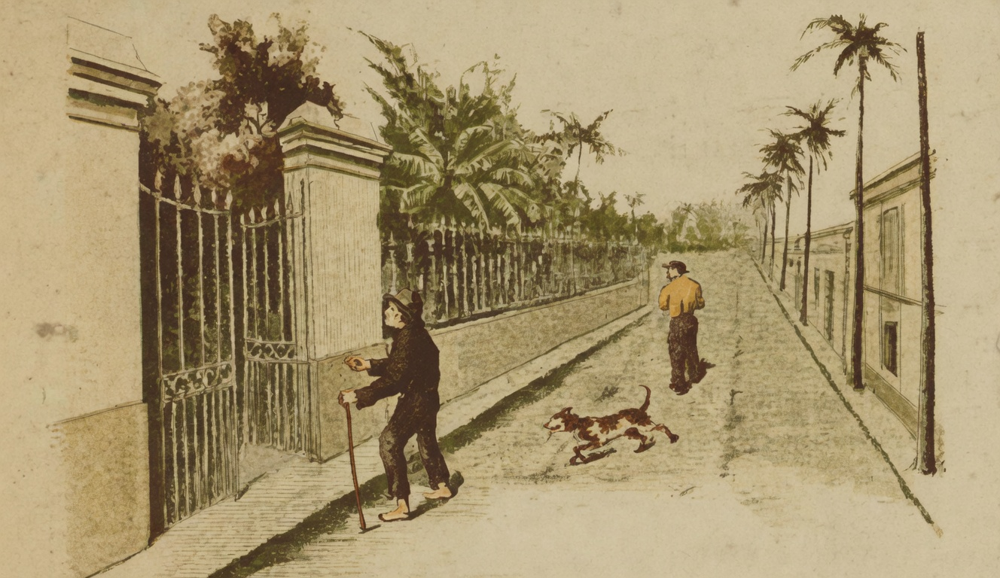

# Os Pobres

{alt="Rua com palmeiras e grades; homem de muleta à esquerda, outro ao fundo com um cão. Litografia da edição de 1904. Iniciais HM à esquerda."}

| Ahi veem pelos caminhos,
| Descalços, de pés no chão,
| Os pobres que andam sósinhos,
| Implorando compaixão.

| Vivem sem cama e sem tecto,
| Na fome e na solidão :
| Pedem um pouco de affecto,
| Pedem um pouco de pão.

| São timidos ? São covardes ?
| Teem pejo? Teem confusão?
| Parae quando os encontrardes,
| E dae-lhes a vossa mão !

| Guiae-lhes os tristes passos !
| Dae-lhes, sem hesitação,
| O apoio de vossos braços,
| Metade de vosso pão !

| Não receieis que, algum dia,
| Vos assalte a ingratidão :
| O premio está na alegria
| Que tereis no coração.

| Protegei os desgraçados,
| Orphãos de toda a affeição :
| E sereis abençoados
| Por um pedaço de pão...
