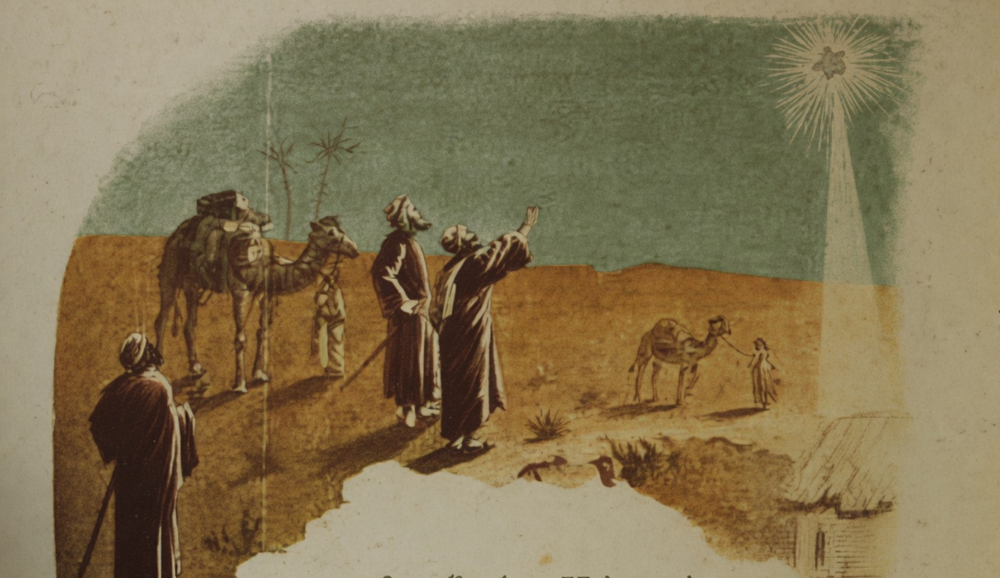

# Os Reis Magos

{alt="Três magos e camelos no deserto; estrella à direita. Litografia da edição de 1904. Iniciais HM à esquerda."}

| Diz a Sagrada Escriptura
| Que, quando Jesus nasceu,
| No céo, fulgurante e pura,
| Uma estrella appareceu.

| Estrella nova... Brilhava
| Mais do que as outras ; porém
| Caminhava, caminhava
| Para os lados de Belém.

| Avistando-a, os tres Reis Magos
| Disseram : « Nasceu Jesus! »
| Olharam-na com affagos,
| Seguiram a sua luz.

| E foram andando, andando,
| Dia e noite a caminhar ;
| Viam a estrella brilhando,
| Sempre o caminho a indicar.

| Ora, dos tres caminhantes,
| Dois eram brancos : o sol
| Não lhes tisnara os semblantes
| Tão claros como o arrebol.

| Era o terceiro somente
| Escuro de fazer dó...
| Os outros iam na frente;
| Elle ia affastado e só.

| Nascera assim negro, e tinha
| A côr da noite na tez :
| Por isso tão triste vinha...
| Era o mais feio dos tres!

| Andaram. E, um bello dia,
| Da jornada o fim chegou ;
| E, sobre uma estrebaria,
| A estrella errante parou.

| E os Magos viram que, ao fundo
| Do presepe, vendo-os vir,
| O Salvador d'este mundo
| Estava, lindo, a sorrir.

| Ajoelharam-se, rezaram
| Humildes, postos no chão;
| E ao Deus-Menino beijaram
| A alva e pequenina mão.

| E Jesus os contemplava
| A todos com o mesmo amor,
| Porque, olhando-os, não olhava
| A diferença da côr...
