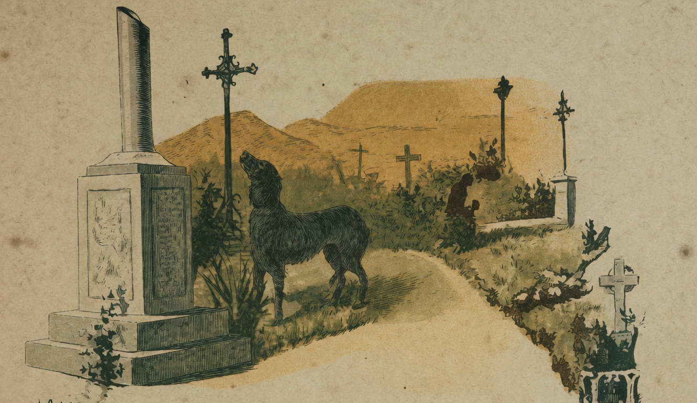

# Plutão

{alt="Cemitério: cão junto a um túmulo, cruzes ao fundo. Litografia da edição de 1904. Iniciais HM à esquerda."}

| Negro, com os olhos em braza,
| Bom, fiel e brincalhão,
| Era a alegria da casa
| O corajoso Plutão.

| Fortissimo, agil no salto,
| Era o terror dos caminhos,
| E duas vezes mais alto
| Do que o seu dono Carlinhos.

| Jamais á casa chegára
| Nem a sombra de um ladrão ;
| Pois fazia medo a cara
| Do destemido Plutão.

| Dormia durante o dia,
| Mas, quando a noite chegava,
| Junto á porta se estendia,
| Montando guarda ficava.

| Porém Carlinhos, rolando
| Com elle ás tontas no chão,
| Nunca sahia chorando
| Mordido pelo Plutão...

| Plutão velava-lhe o somno,
| Seguia-o quando acordado :
| O seu pequenino dono
| Era todo o seu cuidado.

| Um dia cahiu doente
| Carlinhos... Junto ao colchão
| Vivia constantemente,
| Triste e abatido, o Plutão.

| Vieram muitos doutores,
| Em vão. Toda a casa afflicta,
| Era uma casa de dores,
| Era uma casa maldita.

| Morreu Carlinhos... A um canto,
| Gania e ladrava o cão ;
| E tinha os olhos em pranto,
| Como um homem, o Plutão.

| Depois, seguio o menino,
| Seguio-o callado e serio ;
| Quiz ter o mesmo destino :
| Não sahio do cemiterio.

| Foram um dia á procura
| D'elle. E, esticado no chão,
| Junto de uma sepultura,
| Acharam morto o Plutão.
