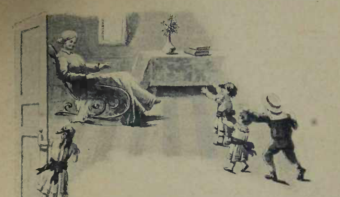

# A Avó

{alt="Avó recostada numa poltrona à esquerda, de vestido claro; mesa ao fundo com vaso e livros; uma menina junto à porta; duas crianças brincam à direita, uma de chapéu. Litografia da edição de 1904. Iniciais HM à direita, no original."}

| A avó, que tem oitenta annos,
| Está tão fraca e velhinha!..
| Teve tantos desenganos!
| Ficou branquinha, branquinha,
| Com os desgostos humanos.

| Hoje, na sua cadeira,
| Repousa, pallida e fria,
| Depois de tanta canceira :
| E cochila todo o dia,
| E cochila a noite inteira.

| Ás vezes, porém, o bando
| Dos netos invade a sala...
| Entram rindo e papagueiando :
| Este briga, aquelle falla,
| Aquelle dansa, pulando...

| A velha acorda sorrindo,
| E a alegria a transfigura;
| Seu rosto fica mais lindo,
| Vendo tanta travessura,
| E tanto barulho ouvindo.

| Chama os netos adorados,
| Beija-os, e, tremulamente,
| Passa os dedos engelhados,
| Lentamente, lentamente,
| Por seus cabellos doirados.

| Fica mais moça, e palpita,
| E recupera a memoria,
| Quando um dos netinhos grita :

| « Ó vovó! conte uma historia!
| Conte uma historia bonita! »

| Então, com phrases pausadas,
| Conta historias de chimeras,
| Em que ha palacios de fadas,
| E feiticeiras, e feras,
| E princezas encantadas...

| E os netinhos estremecem,
| Os contos acompanhando,
| E as travessuras esquecem,
| — Até que, a fronte inclinando,
| Sobre o seu collo adormecem...
